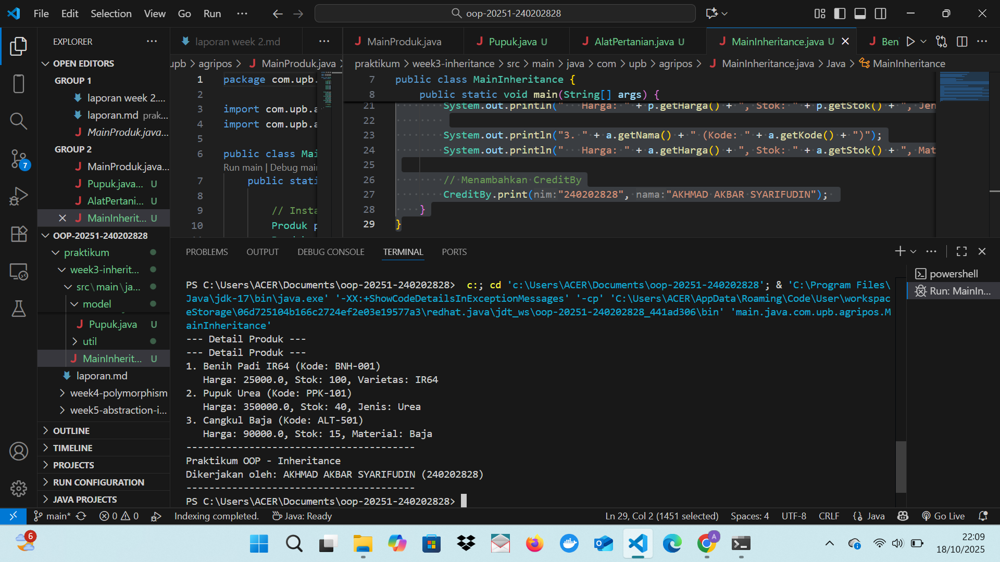
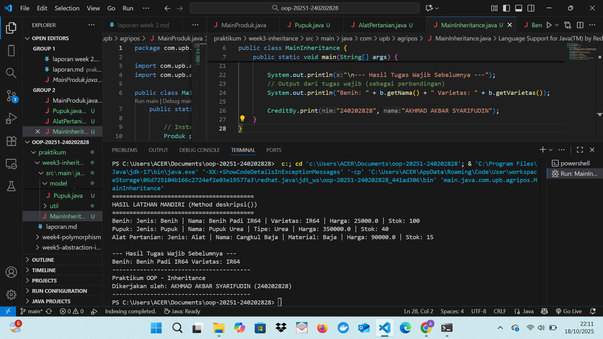

# Laporan Praktikum Minggu 3
Topik: [Inheritance (Pewarisan Class dan Kategori Produk)]

## Identitas
- Nama  : Akhmad Akbar Syarifudin
- NIM   : 240202828
- Kelas : 3IKRA

---

## Tujuan
1. Mahasiswa mampu menjelaskan konsep inheritance (pewarisan class) dalam OOP.

2. Mahasiswa mampu membuat superclass dan subclass untuk produk pertanian.

3. Mahasiswa mampu mendemonstrasikan hierarki class melalui contoh kode.

4. Mahasiswa mampu menggunakan super untuk memanggil konstruktor dan method parent class.

5. Mahasiswa mampu membuat laporan praktikum yang menjelaskan perbedaan penggunaan inheritance dibanding class tunggal.

---

## Dasar Teori
1. Inheritance (Pewarisan): Mekanisme OOP di mana suatu Subclass (anak) mewarisi atribut dan method dari Superclass (induk), mempromosikan code reusability.

2. Superclass: Class induk (Produk) yang mendefinisikan sifat umum.

3. Subclass: Class turunan (Benih, Pupuk) yang mewarisi sifat umum dan dapat menambahkan sifat khusus (spesialisasi).

4. Kata Kunci super: Digunakan di Subclass untuk memanggil constructor atau method dari Superclass.

---

## Langkah Praktikum
1. Setup Struktur: Menggunakan package dan struktur folder yang sudah ada (com.upb.agripos.model dan com.upb.agripos.util).

2. Class Produk: Menggunakan kembali Produk.java dari Minggu 2 sebagai Superclass.

3. Membuat Subclass: Membuat tiga Subclass: Benih.java (dengan atribut varietas), Pupuk.java (dengan atribut jenis), dan AlatPertanian.java (dengan atribut material), semuanya menggunakan extends Produk.

4. Membuat Konstruktor: Menerapkan constructor di setiap Subclass yang wajib memanggil super(kode, nama, harga, stok) untuk inisialisasi properti yang diwariskan.

5. Latihan Mandiri: Menambahkan method deskripsi() di setiap Subclass untuk menunjukkan spesialisasi.

6. Main Class: Menginstansiasi objek dari tiap Subclass di MainInheritance.java dan memanggil method yang diwariskan (getNama(), getHarga()) serta method khusus (getVarietas(), deskripsi()).

7. Commit Message: week3-inheritance.

---

## Kode Program

```java
// Benih
package main.java.com.upb.agripos.model; 

public class Benih extends Produk {
    private String varietas;

    public Benih(String kode, String nama, double harga, int stok, String varietas) {
        super(kode, nama, harga, stok);
        this.varietas = varietas;
    }

    // tambahan 
    public String deskripsi() {
        return "Jenis: Benih | Nama: " + getNama() + " | Varietas: " + varietas +
               " | Harga: " + getHarga() + " | Stok: " + getStok();
    }

    public String getVarietas() { return varietas; }
    public void setVarietas(String varietas) { this.varietas = varietas; }
}

```

```java
//Pupuk
package main.java.com.upb.agripos.model; 

public class Pupuk extends Produk {
    private String jenis;

    public Pupuk(String kode, String nama, double harga, int stok, String jenis) {
        super(kode, nama, harga, stok);
        this.jenis = jenis;
    }

    // tambahan
    public String deskripsi() {
        return "Jenis: Pupuk | Nama: " + getNama() + " | Tipe: " + jenis +
               " | Harga: " + getHarga() + " | Stok: " + getStok();
    }

    public String getJenis() { return jenis; }
    public void setJenis(String jenis) { this.jenis = jenis; }
}

```java
//AlatPertanian
package main.java.com.upb.agripos.model; 

public class AlatPertanian extends Produk {
    private String material;

    public AlatPertanian(String kode, String nama, double harga, int stok, String material) {
        super(kode, nama, harga, stok);
        this.material = material;
    }

    // tambahan
    public String deskripsi() {
        return "Jenis: Alat | Nama: " + getNama() + " | Material: " + material +
               " | Harga: " + getHarga() + " | Stok: " + getStok();
    }

    public String getMaterial() { return material; }
    public void setMaterial(String material) { this.material = material; }
}

```

```java
//MainInheritance
package main.java.com.upb.agripos; 

import main.java.com.upb.agripos.model.*; 
import main.java.com.upb.agripos.util.CreditBy;

public class MainInheritance {
    public static void main(String[] args) {
        // Subclass
        Benih b = new Benih("BNH-001", "Benih Padi IR64", 25000, 100, "IR64");
        Pupuk p = new Pupuk("PPK-101", "Pupuk Urea", 350000, 40, "Urea");
        AlatPertanian a = new AlatPertanian("ALT-501", "Cangkul Baja", 90000, 15, "Baja");

    
        System.out.println("=========================================");
        System.out.println("HASIL LATIHAN MANDIRI (Method deskripsi())");
        System.out.println("=========================================");
        
        System.out.println("Benih: " + b.deskripsi());
        System.out.println("Pupuk: " + p.deskripsi());
        System.out.println("Alat Pertanian: " + a.deskripsi());
        
        System.out.println("\n--- Hasil Tugas Wajib Sebelumnya ---");
        // Output dari tugas wajib 
        System.out.println("Benih: " + b.getNama() + " Varietas: " + b.getVarietas());
        
        CreditBy.print("240202828", "AKHMAD AKBAR SYARIFUDIN"); 
    }
}

```

---

## Hasil Eksekusi





---

## Analisis
(
1. Cara Kerja Kode: Class Benih, Pupuk, dan AlatPertanian berhasil mewarisi atribut dan method dari Produk. Pada saat instansiasi, kata kunci super() di Subclass memastikan semua properti dasar produk (kode, nama, harga, stok) terinisialisasi oleh Constructor Produk. Kemudian, method deskripsi() di setiap Subclass dapat mengakses properti yang diwariskan (getNama(), getStok()) dan menggabungkannya dengan properti spesifik Subclass (varietas, jenis, material).

2. Perbedaan Pendekatan Minggu Ini (Inheritance) Dibanding Minggu Sebelumnya (Class Tunggal/Enkapsulasi):

- Minggu 2 (Enkapsulasi/Class Tunggal): Fokus pada integritas data satu Class (Produk). Jika ada kategori produk baru (misal, Pestisida), atribut uniknya harus ditambahkan langsung ke Produk.java, yang akan membuat Class tersebut semakin besar dan kompleks (God Object).

- Minggu 3 (Inheritance): Fokus pada code reusability dan hirarki. Properti dasar dipertahankan di Produk, sementara sifat unik diletakkan di Subclass spesifik. Hal ini membuat penambahan kategori baru (misal: Pestisida) menjadi mudah tanpa mengubah kode inti Produk.

3. Kendala yang Dihadapi: Kendala utama adalah error terkait package dan classpath seperti Unresolved compilation problems dan package does not exist. Hal ini diatasi dengan menstandarkan semua package di keenam file menjadi format main.java.com.upb... dan memastikan semua import serta constructor (menggunakan super()) sudah benar.
)
---

## Kesimpulan
(Praktikum Minggu 3 ini berhasil menerapkan konsep Inheritance dengan membuat hirarki Superclass Produk dan Subclass kategori produk. Penggunaan Inheritance sangat penting dalam pengembangan sistem POS karena memungkinkan penambahan kategori produk baru secara modular dan efisien, menjaga Class Produk tetap bersih dan fokus pada tanggung jawab intinya.)

---

## Quiz
1. Mengapa keuntungan menggunakan inheritance dibanding membuat class terpisah tanpa hubungan? Jawaban: Keuntungannya adalah Reusability Kode (Kode dasar produk, seperti atribut nama, harga, dan stok, tidak perlu ditulis ulang di setiap Subclass) dan Konsistensi/Struktur Kode (memudahkan pengelolaan dan maintenance karena ada hierarki yang jelas).

2. Bagaimana cara subclass memanggil konstruktor superclass? Jawaban: Dengan menggunakan kata kunci super(...) di baris pertama constructor Subclass.

3. Berikan contoh kasus di POS pertanian selain Benih, Pupuk, dan Alat Pertanian yang bisa dijadikan subclass. Jawaban: Pestisida (dengan atribut tambahan: jenis hama sasaran, dosis) atau Layanan Jasa (dengan atribut tambahan: durasi pengerjaan, satuan luas).
